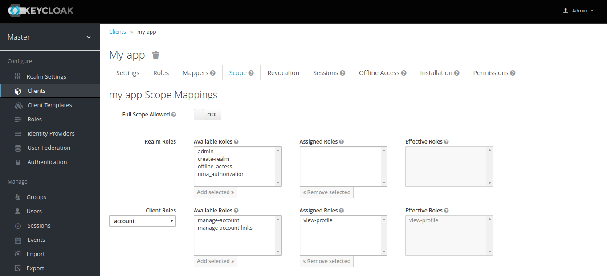

# Keycloak Angular

[](https://opensource.org/licenses/MIT)
[](https://slackin-iijwrzzihr.now.sh)
[](https://badge.fury.io/js/keycloak-angular)
[](https://travis-ci.org/mauriciovigolo/keycloak-angular)

<!-- 
[](https://david-dm.org/mauriciovigolo/keycloak-angular)
[](https://david-dm.org/mauriciovigolo/keycloak-angular?type=dev)
-->

[Keycloak-js](https://github.com/keycloak/keycloak-js-bower) port for Angular > v4.3 applications.


---

* [About](#about)
* [Install](#install)
* [Setup](#setup)
  * [Angular](#angular)
  * [Keycloak](#keycloak)
* [AuthGuard](#authguard)
* [HttpClient Interceptor](#httpclient-interceptor)
* [Contributing](#contributing)
* [License](#license)

---

## About

This library helps you to use [keycloak-js](https://github.com/keycloak/keycloak-js-bower) in Angular > v4.3 applications providing the following features:

* A **Keycloak Service** which wraps the keycloak-js methods to be used in Angular, giving extra
  functionalities to the original functions and adding new methods to make it easier to be consumed by
  Angular applications.
* Generic **AuthGuard implementation**, so you can customize your own AuthGuard logic inheriting the authentication logic and the roles load.
* A **HttpClient interceptor** that adds the authorization header to all HttpClient requests.
  It is also possible to exclude routes from having the authorization header.
* This documentation also assists you to configure the keycloak in the Angular applications and with
  the client setup in the admin console of your keycloak installation.

## Install

**Attention**: This library will work only with versions higher or equal than 4.3.0 of Angular. The reason for this is that we are using Interceptor from `@angular/common/http` package.

In your angular application directory:

With npm:

```sh
npm install --save keycloak-angular
```

With yarn:

```sh
yarn add keycloak-angular
```

## Setup

### Angular

The KeycloakService should be initialized during the application loading, using the [APP_INITIALIZER](https://angular.io/api/core/APP_INITIALIZER) token.

#### AppModule

```js
import { NgModule, APP_INITIALIZER } from '@angular/core';
import { KeycloakService, KeycloakAngularModule } from 'keycloak-angular';
import { initializer } from './utils/app-init';

@NgModule({
  imports: [KeycloakAngularModule],
  providers: [
    {
      provide: APP_INITIALIZER,
      useFactory: initializer,
      multi: true,
      deps: [KeycloakService]
    }
  ]
})
export class AppModule {}
```

* **Notice** that the KeycloakAngularModule was imported by the AppModule. For this reason you don't need to insert the KeycloakService in the AppModule providers array.

#### initializer Function

This function can be named and placed in the way you think is most appropriate. The
underneath example was put in a separate file `app-init.ts` and the function called
`initializer`.

```js
import { KeycloakService } from 'keycloak-angular';

export function initializer(keycloak: KeycloakService): () => Promise<any> {
  return (): Promise<any> => {
    return new Promise(async (resolve, reject) => {
      try {
        await keycloak.init();
        resolve();
      } catch (error) {
        reject(error);
      }
    });
  };
}
```

### Keycloak

Besides configuring the keycloak lib in your application it is also necessary to setup the
access - scope for the **account** client.

In this documentation we suppose that you already installed and configured your Keycloak
instance, as well created the client app.

**Hint:** If you need to create an environment for testing purposes, try out the [Keycloak demo](http://www.keycloak.org/downloads.html).

#### Client configuration

When requesting the method to get the User's Profile, the client app should have the scope and access to the account **view-profile** role. To do it, access **Clients** :arrow_right: **My-app** :arrow_right: **Scope**. Select the **account** app in Client Roles and assign the view-profile role.



## AuthGuard

A generic AuthGuard, `KeycloakAuthGuard`, was created to help you bootstrap your security configuration and avoid duplicate code. This class already checks if the user is logged in and get the list of roles from the authenticated user, provided by the keycloak instance. In your implementation you just need to implement the desired security logic.

Example:

```js
import { Injectable } from '@angular/core';
import { CanActivate, Router, ActivatedRouteSnapshot, RouterStateSnapshot } from '@angular/router';
import { KeycloakService, KeycloakAuthGuard } from 'keycloak-angular';

@Injectable()
export class AppAuthGuard extends KeycloakAuthGuard {
  constructor(protected router: Router, protected keycloakAngular: KeycloakService) {
    super(router, keycloakAngular);
  }

  isAccessAllowed(route: ActivatedRouteSnapshot, state: RouterStateSnapshot): Promise<boolean> {
    return new Promise(async (resolve, reject) => {
      if (!this.authenticated) {
        this.keycloakAngular.login();
        return;
      }

      const requiredRoles = route.data.roles;
      if (!requiredRoles || requiredRoles.length === 0) {
        return resolve(true);
      } else {
        if (!this.roles || this.roles.length === 0) {
          resolve(false);
        }
        let granted: boolean = false;
        for (const requiredRole of requiredRoles) {
          if (this.roles.indexOf(requiredRole) > -1) {
            granted = true;
            break;
          }
        }
        resolve(granted);
      }
    });
  }
}
```

## HttpClient Interceptor

By default all HttpClient requests will add the Authorization header in the format of: Authorization: Bearer **_TOKEN_**.

There is also the possibility to exclude a list of URLs that should not have the authorization header. The excluded list must be informed in the keycloak initialization. For example:

```js
 try {
  await keycloak.init({
    config: {
      url: 'http://localhost:8080/auth',
      realm: 'your-realm',
      clientId: 'client-id'
    },
    initOptions: {
      onLoad: 'login-required',
      checkLoginIframe: false
    },
    bearerExcludedUrls: [
      '/assets',
      '/clients/public'
    ],
  });
  resolve();
} catch (error) {}
```

## Contributing

If you want to contribute to the project, please check out the [contributing](CONTRIBUTING.md)
document.

## License

Copyright (C) 2018 Mauricio Gemelli Vigolo and contributors.

Permission is hereby granted, free of charge, to any person obtaining a copy
of this software and associated documentation files (the "Software"), to deal
in the Software without restriction, including without limitation the rights
to use, copy, modify, merge, publish, distribute, sublicense, and/or sell
copies of the Software, and to permit persons to whom the Software is
furnished to do so, subject to the following conditions:

The above copyright notice and this permission notice shall be included in
all copies or substantial portions of the Software.

THE SOFTWARE IS PROVIDED "AS IS", WITHOUT WARRANTY OF ANY KIND, EXPRESS OR
IMPLIED, INCLUDING BUT NOT LIMITED TO THE WARRANTIES OF MERCHANTABILITY,
FITNESS FOR A PARTICULAR PURPOSE AND NONINFRINGEMENT. IN NO EVENT SHALL THE
AUTHORS OR COPYRIGHT HOLDERS BE LIABLE FOR ANY CLAIM, DAMAGES OR OTHER
LIABILITY, WHETHER IN AN ACTION OF CONTRACT, TORT OR OTHERWISE, ARISING FROM,
OUT OF OR IN CONNECTION WITH THE SOFTWARE OR THE USE OR OTHER DEALINGS IN
THE SOFTWARE.
